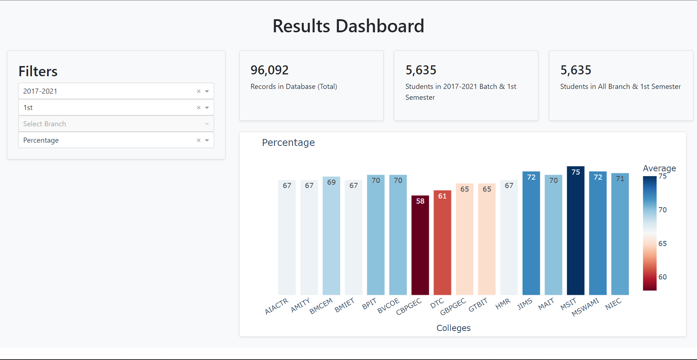

_Important Notice 😮_
_The deployment of the active version of the website is done from another private repository. The contents of this repository are old and obsolete now. The code structure of the new website is based on a different tech stack (FastAPI + Flask + Plotly + Dash), this version can be used as a backup in the future._

# IPU-Website 😎

## About 😁
- This is an unofficial result portal developed to ease the process of checking the results.
- Generally, we get results in form of long PDFs which are difficult to read and one can barely calculate the percentage.
- Predicting the ranks is next to impossible thing! This portal serves all these things.
- You get a nice marks presentation, percentage, SGPA, CGPA, and ranks at both college and university levels.
- You can also generate your profile which gives out all the previous semesters' results.
- What's for me in this? Nothing! No ads, no bloatware.

## Preview (As of 5th Oct, 2021) 😉

## Dashboard Preview (As of 17th Oct, 2021)
